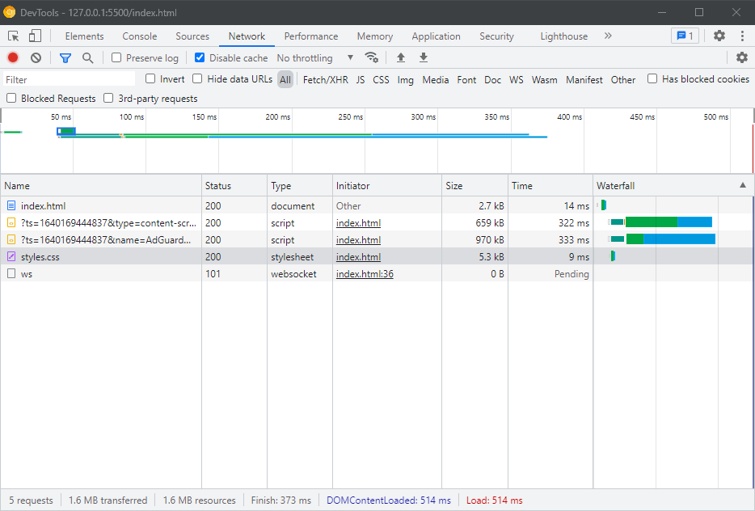
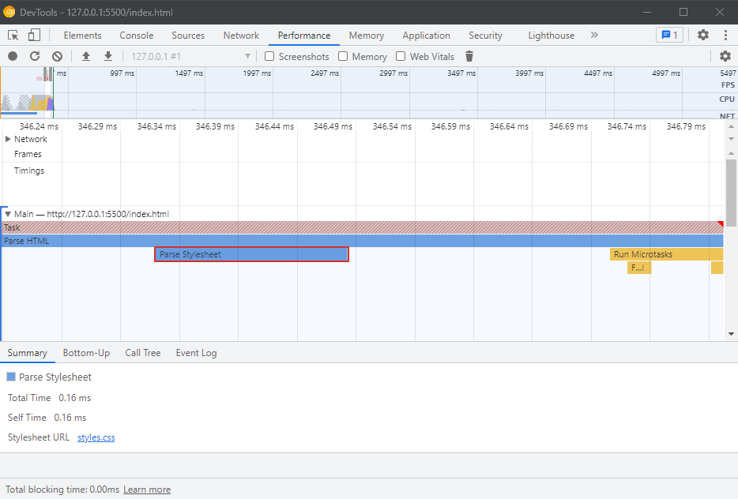
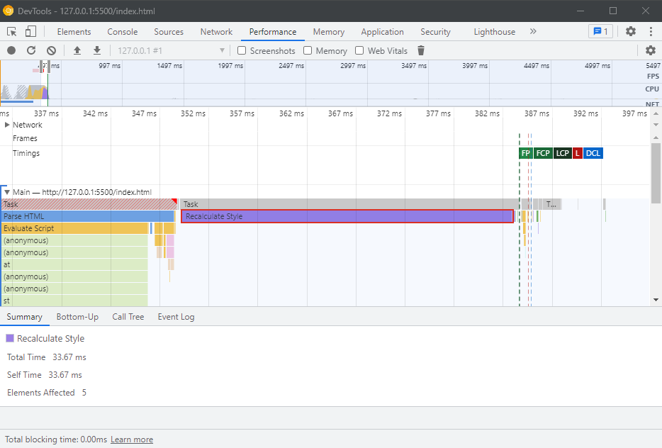

## Remove all unused CSS rules that were included in the bundle

**Here we removed multiple css files that were added to the page completely unrelated. Now the page fetches and loads the css file that is needed only for this page.**

## Metrics

- File size : 5.3kb
- Time to fetch : 9ms
- Time to parse : 0.16ms
- Time to recalculate : 33.67ms

