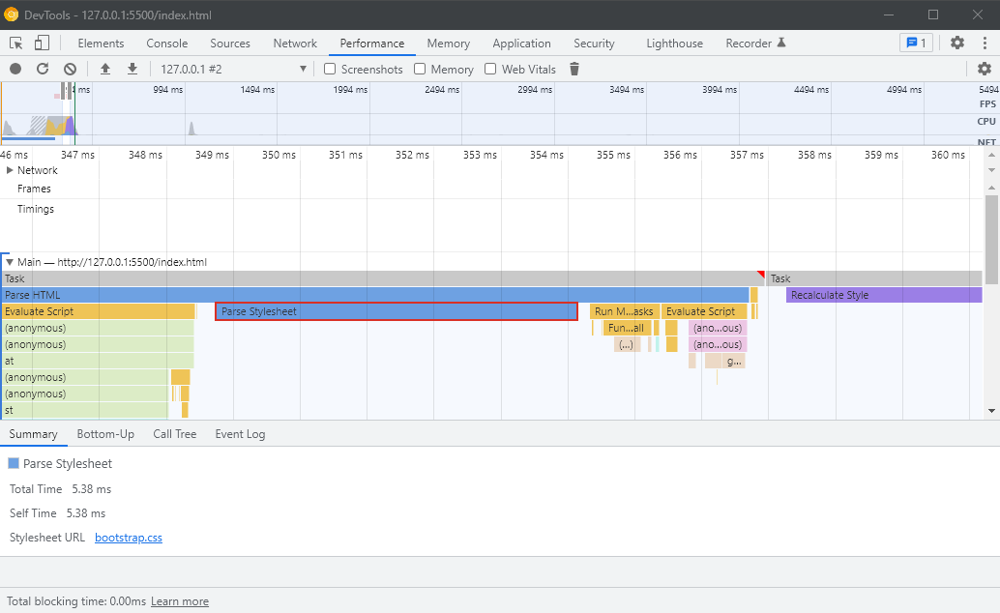
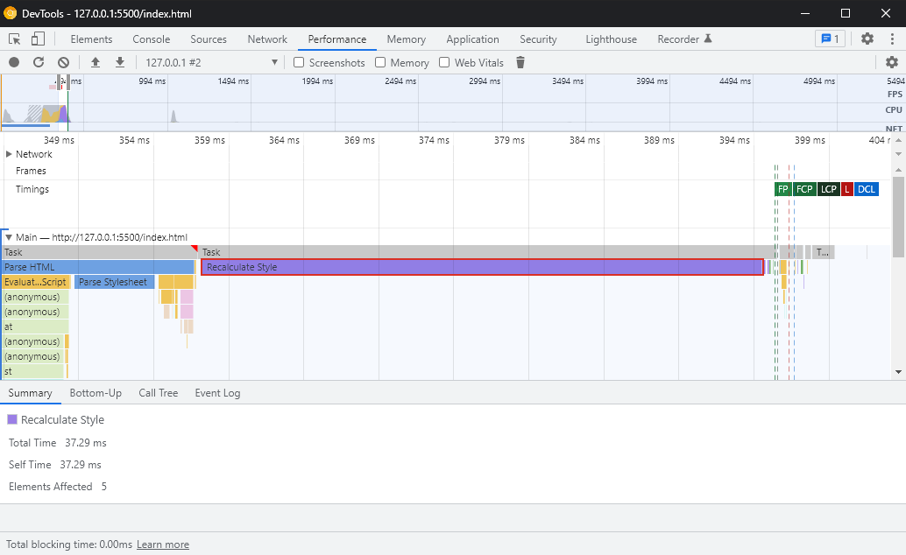

## Loading only the css related to the page

**Here we removed multiple css files that were added to the page completely unrelated. Now the page fetches and loads the css file that is needed only for this page.**

## Metrics

- File size : 206kb
- Time to fetch : 23ms
- Time to parse : 5.38ms
- Time to recalculate : 37.29ms

